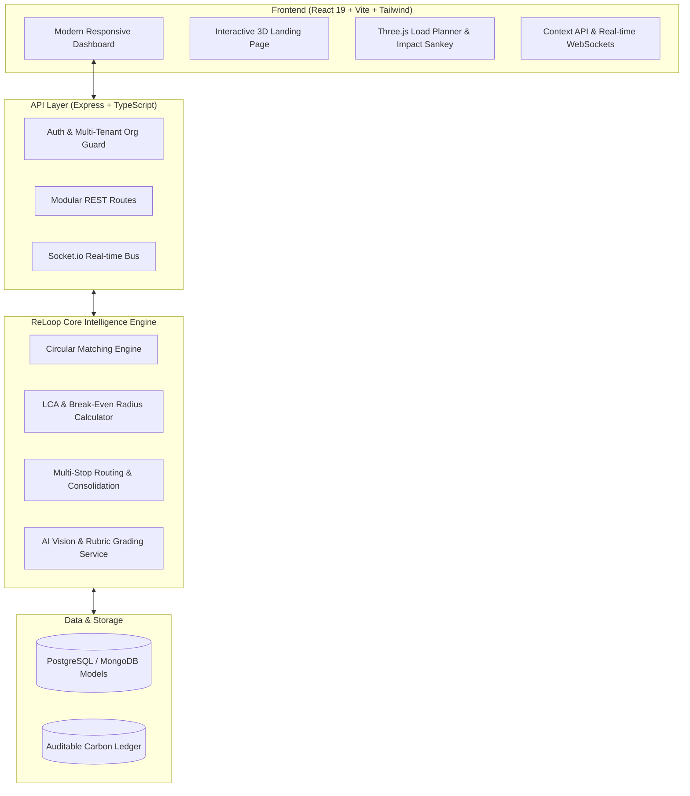

# 🔄 ReLoop — Carbon-Aware B2B Circular Packaging & Materials Exchange

<div align="center">

[](https://opensource.org/licenses/MIT)
[](https://nodejs.org/)
[](https://react.dev/)
[](https://www.typescriptlang.org/)
[](https://vitejs.dev/)
[](https://tailwindcss.com/)
[](https://expressjs.com/)

**Transforming industrial packaging surplus into auditable circular supply loops with real-time carbon break-even analytics, AI quality grading, and consolidated route optimization.**

[Explore Features](#-key-features) • [Architecture](#-system-architecture) • [Getting Started](#-getting-started) • [Tech Stack](#-technology-stack) • [PRD](docs/PRD.md)

</div>

---

## 🌍 The Mission & Problem Context

Manufacturing, logistics, and retail generate millions of tons of structurally sound packaging waste each year—**corrugated cardboard, HDPE drums, wooden pallets, intermediate bulk containers (IBCs), stretch film, and plastic totes**. 

Although a large percentage of this material is reusable, it frequently ends up in landfills or low-value downcycling due to three structural market failures:

1. **The Trust Deficit**: Procurement managers cannot risk acquiring hundreds of unverified pallets or containers from unknown counterparties without condition guarantees.
2. **Logistics Economics**: Recovered secondary packaging has low mass-to-value ratios. Dedicating a single truck for low volumes erodes profit margins and creates empty backhauls.
3. **Unverified Greenwashing**: Traditional exchanges report generic "diverted tonnage" figures that lack carbon accounting rigor or transport emission penalties.

### 💡 The Core Innovation: Carbon Break-Even Radius

> Moving material is not emission-free. Reuse avoids virgin manufacturing emissions ($\text{CO}_2\text{e}_\text{embodied}$), but freight generates transport emissions ($\text{CO}_2\text{e}_\text{transport}$).

**ReLoop** models this trade-off explicitly in its matching engine:

$$\text{Net Carbon Saved} = \text{Embodied CO}_2\text{e Avoided} - \text{Transport CO}_2\text{e Emitted}$$

If the transit distance exceeds the **Carbon Break-Even Radius**, ReLoop automatically suppresses or warns against the trade—ensuring every circular transaction delivers a provable, net-positive environmental benefit.

---

## ✨ Key Features

### 📦 1. 90-Second Yard Listing & AI Quality Grading
- Quick listing workflow designed for warehouse managers in high-throughput yards.
- Computer-vision-assisted grading based on structural integrity, contamination level, and moisture.
- Automated material category classification (OCC, HDPE, Wood, Strapping, Film).

### ⚡ 2. Real-Time Carbon Intelligence Engine
- Automatic computation of **Gross Avoided Carbon** vs **Freight Carbon Debt**.
- Live **Carbon Break-Even Distance** indicators on every material listing.
- Defensible, audit-ready carbon ledger conforming to GHG Protocol Scope 3 requirements.

### 🚛 3. Consolidated Logistics & 3D Load Planning
- Multi-stop pickup route planning to combine small lots from nearby facilities into single freight runs.
- Backhaul matching algorithm to utilize empty truck return journeys.
- Interactive **3D Cargo Load Visualizer** to preview volumetric distribution and axle weight limits.

### 🤝 4. Secure B2B Trade & Escrow Lifecycle
- Streamlined quotation, dynamic counter-offers, and binding digital order confirmations.
- Dispute protection and custody transfer tracking from dispatch to weighbridge check-in.
- Downloadable **Digital Product Passports** and ESG compliance certificates for enterprise sustainability reporting.

---

## 🏗️ System Architecture



---

## 🛠️ Technology Stack

| Domain | Technologies |
|---|---|
| **Frontend UI/UX** | React 19, Vite, Tailwind CSS, Framer Motion, Lucide Icons, Lenis Smooth Scroll |
| **3D & Visualizations** | Three.js, Canvas 3D Load Simulator, Interactive Flow Globes |
| **Backend Framework** | Node.js, Express, TypeScript, Zod, Helmet, Winston Logger |
| **Database & ORM** | PostgreSQL / Sequelize, MongoDB / Mongoose |
| **Real-time & Network** | Socket.io, RESTful Modular Endpoints, Axios |
| **LCA & Carbon Intelligence** | Custom Carbon LCA Model, Haversine / OSRM Distance Matrix |

---

## 📁 Repository Structure

```
ReLoop/
├── backend/                    # Express + TypeScript Modular Monolith
│   ├── src/
│   │   ├── config/             # Environment, DB, and app configuration
│   │   ├── modules/
│   │   │   ├── auth/           # Authentication, JWT, and permissions
│   │   │   ├── listings/       # Material listings, media, and parsing
│   │   │   ├── matching/       # Carbon-aware matching algorithm
│   │   │   ├── carbon/         # LCA emission factors & break-even engine
│   │   │   ├── logistics/      # Route optimization & vehicle tracking
│   │   │   ├── orders/         # B2B orders, invoices, and transactions
│   │   │   ├── grading/        # Vision provider and rubric grading
│   │   │   └── organizations/  # Org profiles, threshold guards & audits
│   │   ├── services/           # Shared storage, email, routing, impact
│   │   ├── sockets/            # Real-time WebSocket handlers
│   │   └── server.ts           # Application entry point
│   ├── package.json
│   └── tsconfig.json
├── frontend/                   # React 19 + Vite + Tailwind Web Application
│   ├── src/
│   │   ├── components/         # Reusable UI, Nav, Modals, 3D Visualizers
│   │   ├── context/            # Global App and Auth state management
│   │   ├── pages/
│   │   │   ├── Landing/        # 3D interactive animated landing experience
│   │   │   ├── Dashboard/      # Main operations and metrics overview
│   │   │   ├── Listings/       # Browse, filter, and create material lots
│   │   │   ├── Matches/        # Real-time matched buyers and sellers
│   │   │   ├── Logistics/      # Multi-stop routing & load visualizer
│   │   │   ├── Orders/         # Checkout, order tracking, and invoicing
│   │   │   └── Impact/         # ESG reports, LCA metrics & certificates
│   │   ├── services/           # API client and backend service wrappers
│   │   └── index.css           # Custom styling and animations
│   ├── package.json
│   └── vite.config.js
├── docs/
│   └── PRD.md                  # Comprehensive Product Requirements Document
├── package.json                # Root workspace scripts
└── README.md                   # Project documentation
```

---

## 🚀 Getting Started

### Prerequisites
- [Node.js](https://nodejs.org/) (version 18.0.0 or higher recommended)
- `npm` (version 9.0.0 or higher)

### 1. Clone the Repository
```bash
git clone https://github.com/patelrushi2307-cmd/ReLoop.git
cd ReLoop
```

### 2. Install Dependencies
```bash
# Install root, backend, and frontend dependencies
npm install --prefix backend
npm install --prefix frontend
```

### 3. Setup Environment Variables
Create `.env` inside the `backend` folder:
```bash
cp backend/.env.example backend/.env
```
Ensure your database connection strings (MongoDB / PostgreSQL) and JWT secrets are populated.

### 4. Run Development Servers
You can run both services simultaneously from the root:
```bash
# Start backend API (Port 5000)
npm run dev:backend

# In a separate terminal, start frontend (Port 5173)
npm run dev:frontend
```

Open your browser and navigate to `http://localhost:5173`.

### 5. Build for Production
```bash
# Typecheck backend
npm run typecheck:backend

# Build frontend and backend distribution bundles
npm run build:frontend
npm run build:backend
```

---

## 📊 Core API Endpoints

| Method | Endpoint | Description |
|---|---|---|
| `POST` | `/api/v1/auth/register` | Register new organization & administrator |
| `POST` | `/api/v1/auth/login` | Authenticate user and issue JWT token |
| `GET` | `/api/v1/listings` | Fetch active packaging material listings |
| `POST` | `/api/v1/listings` | Create a new material lot with photos & specs |
| `POST` | `/api/v1/listings/grade-preview` | AI-assisted quality assessment preview |
| `GET` | `/api/v1/matching/recommendations` | Get carbon-scored supplier/buyer matches |
| `GET` | `/api/v1/carbon/break-even` | Calculate break-even radius for material & route |
| `POST` | `/api/v1/orders` | Create an order with escrow protection |
| `GET` | `/api/v1/impact/certificate/:tradeId` | Generate certified ESG impact certificate |

---

## 📜 License

This project is licensed under the **MIT License** — see the [LICENSE](LICENSE) file for details.

---

<div align="center">
  <sub>Built with 💚 for the Circular Economy. Powered by <b>ReLoop</b>.</sub>
</div>
